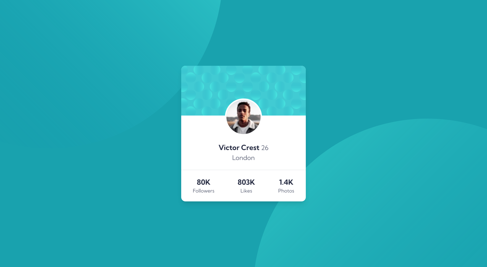

# Frontend Mentor - Profile card component solution

This is a solution to the [Profile card component challenge on Frontend Mentor](https://www.frontendmentor.io/challenges/profile-card-component-cfArpWshJ). Frontend Mentor challenges help you improve your coding skills by building realistic projects. 

## Table of contents

- [Overview](#overview)
  - [The challenge](#the-challenge)
  - [Screenshot](#screenshot)
  - [Links](#links)
- [My process](#my-process)
  - [Built with](#built-with)
  - [What I learned](#what-i-learned)
  - [Continued development](#continued-development)
- [Author](#author)

## Overview

### The challenge

- Build out the project to the designs provided

### Screenshot

### Links

- Solution URL: (https://github.com/djbedford/fm-profile-card)
- Live Site URL: (https://sensational-pudding-879a6d.netlify.app)

## My process

### Built with

- Semantic HTML5 markup
- Flexbox
- Mobile-first workflow
- [Tailwind CSS](https://tailwindcss.com/) - A utility-first CSS framework

### What I learned

During developing this solution there were a couple of obstacles that I had to over come and by overcoming these obstacles I learnt a bit more about Tailwind CSS.
The first issue was the border on the profile picture, as I was using a negative margin to place the image when I added the border the top half was "hidden" behind the background image of the card. To solve this I just needed to set the profile image to have a relative position.
The second obstacle was a bit more tricky and involved using multiple images for the main background and being able to place them individually, this was solved by using the arbitrary value feature of Tailwind CSS which enabled me to use multiple images and set their positions.

### Continued development

Although I was able to place multiple background images when the page is resized or viewed on a mobile device the images tend to move around so I want to continue looking at how I can improve the placement of images on various devices/sizes to better match the design.

## Author

- Frontend Mentor - [@djbedford](https://www.frontendmentor.io/profile/djbedford)
- Twitter - [@djbedford](https://www.twitter.com/djbedford)
